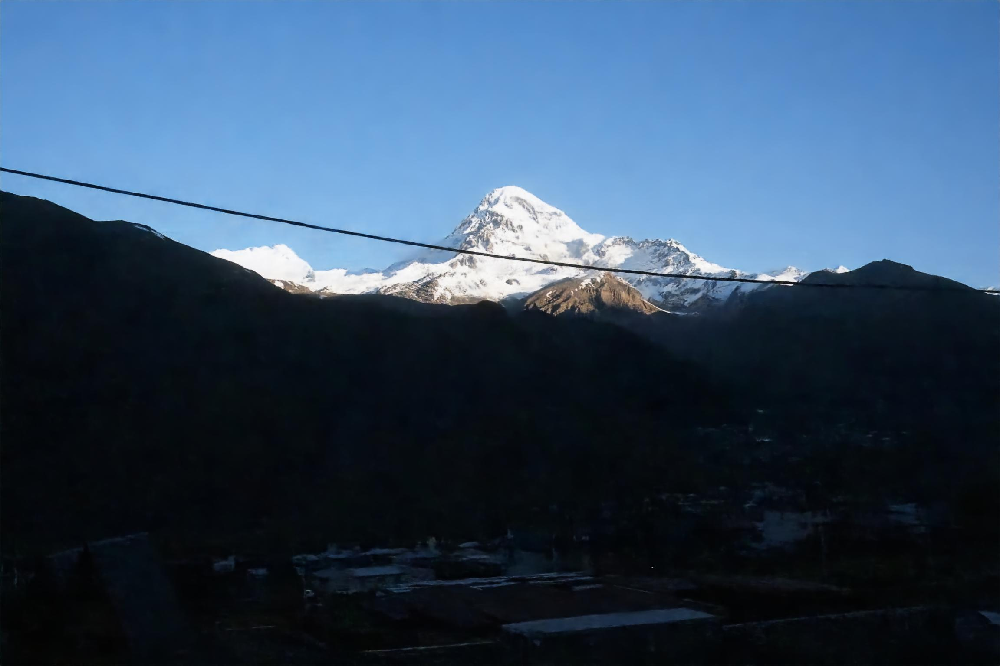
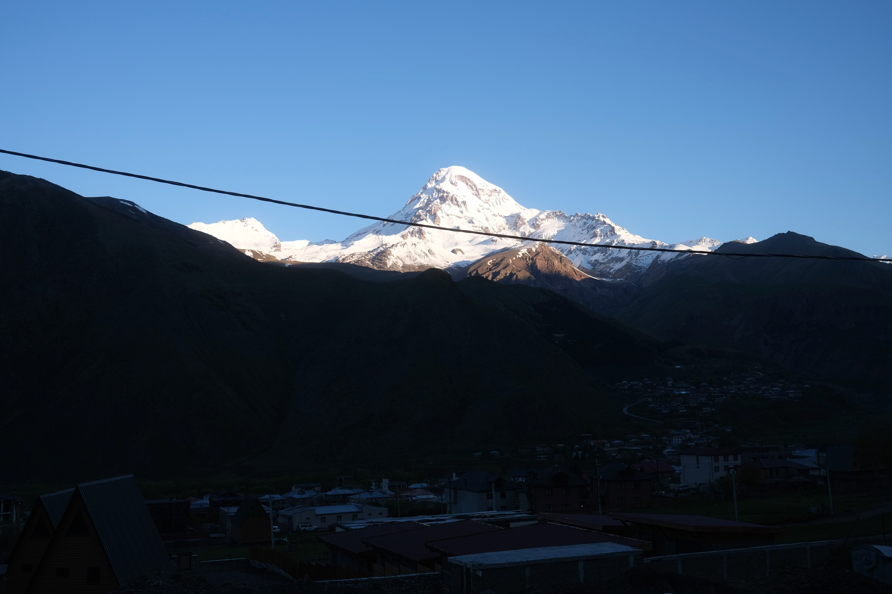
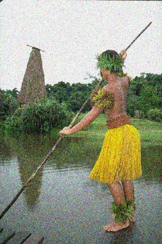
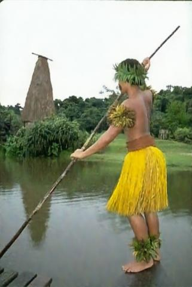
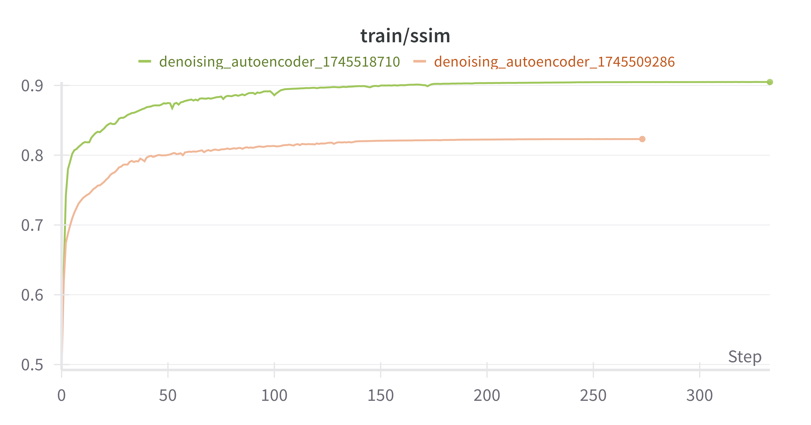
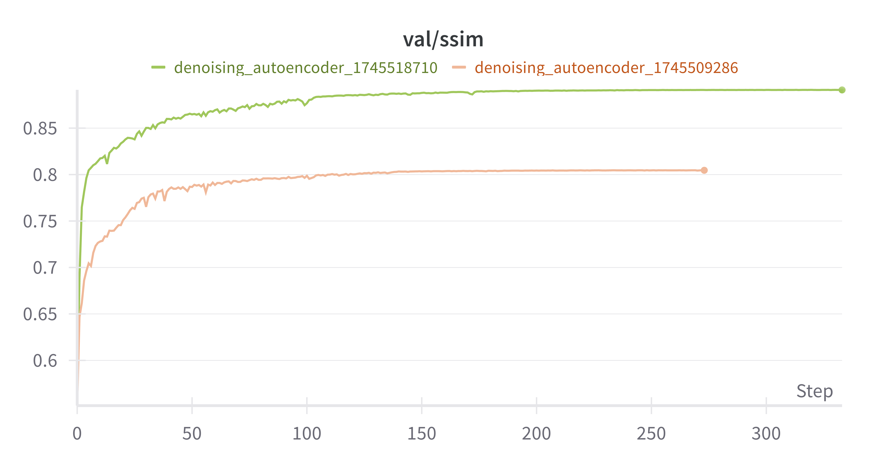
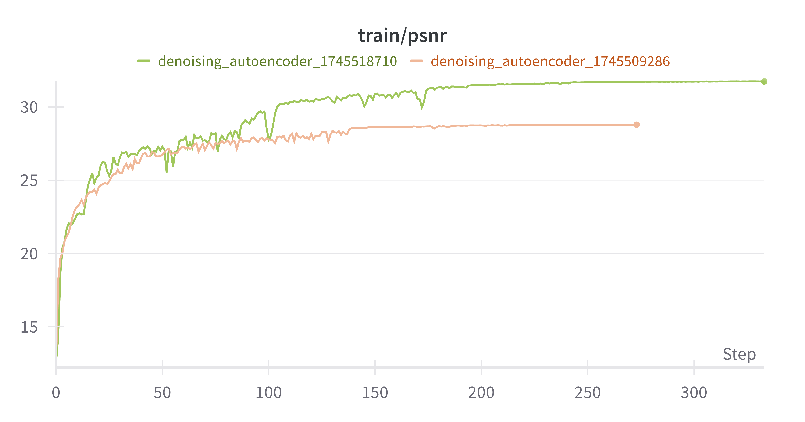
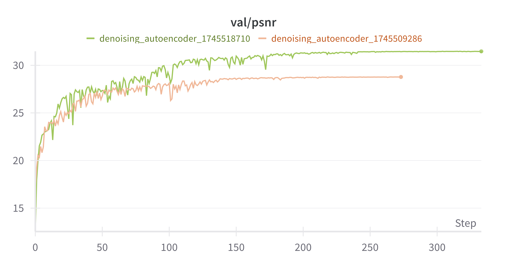
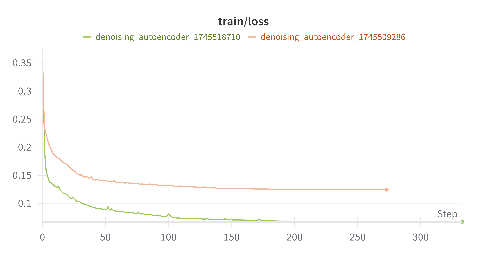
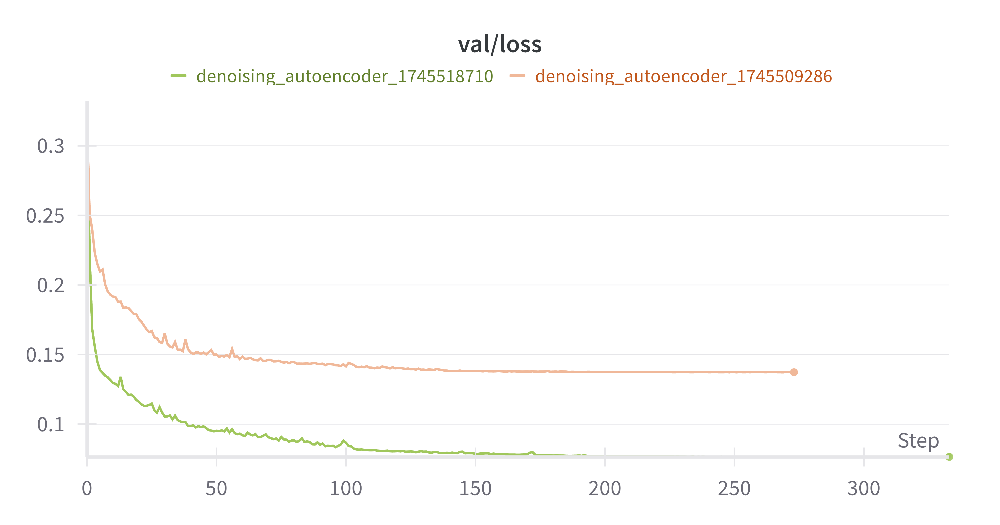

# image-restoration

A simple model to restore images from noise - and in the future from "out of focus" effects.

## Denoising example

### Noise Level σ = 50

#### Landscape Model

Noisy

Denoised

Original

#### BSDS300 model

| Noisy | Denoised | Original |
|-------|----------|----------|
|  |  |  |

## Benchmark Results

RED30 comes from the paper [Xiao-Jiao Mao et al., 2016](https://arxiv.org/pdf/1606.08921).

### SSIM

| Noise Level | RED30 | DA_v1 |
|-------------|-------|-------|
| σ = 30      | 27.95 | 33.77 |
| σ = 50      | 25.75 | 31.47 |

### PSNR

| Noise Level | RED30  | DA_v1 |
|-------------|--------|-------|
| σ = 30      | 0.8019 | 0.9287 |
| σ = 50      | 0.7167 | 0.8911 |

## Training on noise level σ = 50

Green (1745518710) is trained on BSDS300 and pink (1745509286) is trained on a local dataset of landscape images.

#### SSIM

#### PSNR

#### Loss

