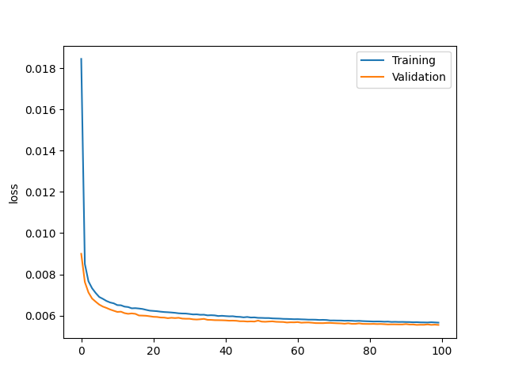
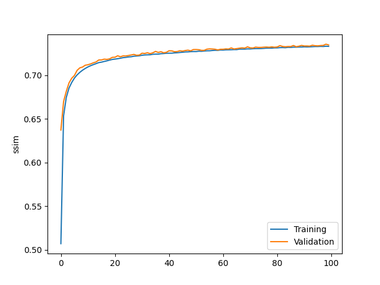

# image-restoration

A simple model to restore images from noise - and in the future from "out of focus" effects.

## v0 Model Architecture

A simple Autoencoder with 3 layers of convolution followed by 3 layers of deconvolution. Image dimensions flow is as follows:

1. pre: 3xHxW -> 3x16x16
2. con-1: 3x16x16 -> 64x16x16
3. con-2: 64x16x16 -> 128x8x18
4. con-3: 128x8x18 -> 256x4x4
5. decon-1: 256x4x4 -> 128x8x18
6. decon-2: 128x8x18 -> 64x16x16
7. decon-3: 64x16x16 -> 3x16x16

Note 1: We have an additional 4th batching dimension.

Note 2: For now we don't resize the image back to its original size since the output of this lightweight network is a small image.

## Training Results

Since we didn't use benchmark images and noise setting/levels, the metrics can't be directly compared. Nevertheless, we can see that
the v0 model is still behind other denoising techniques/models (PSNR scores between ~25 and ~34). We'll tackle this by adding skip
connections between the convolution layer and its adjacent deconvolution layer (inspired by
[Xiao-Jiao Mao et al., 2016](https://arxiv.org/pdf/1606.08921)).

Another issue with the current model is overfitting, which we will attempt to tackle with dropout layers.

Moving forward we should include SSIM evaluation and standard benchmark setup for proper comparison.

### Graphs

